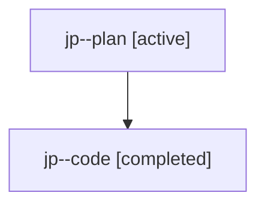

# Family: jp

[Agent Hoods](../README.md) / [bbugyi200](../users/bbugyi200/README.md) / [athena](../users/bbugyi200/machines/athena/README.md) / [jp](../users/bbugyi200/machines/athena/hoods/jp/README.md) / jp

Owner: `bbugyi200.athena` · Hood: `jp` · Members: 2

## Lineage

The diagram is an optional enhancement; the ordered table below contains the same lineage in accessible text.

| Role | Agent | State | Model / provider | Timing | Commits | Prompt | Chat |
|---|---|---|---|---|---:|---|---|
| plan | jp--plan | active | gpt-5.6-sol / codex | 2026-07-24T21:53:00.977526+00:00 | 0 | [Prompt](../agents/bbugyi200.athena.jp--plan/prompt.md) | [Chat](../agents/bbugyi200.athena.jp--plan/chat.md) |
| code | jp--code | completed | gpt-5.6-sol / codex | 2026-07-24T21:59:21.315653+00:00 | [1](../agents/bbugyi200.athena.jp--code/README.md#commits) | — | [Chat](../agents/bbugyi200.athena.jp--code/chat.md) |

## Commits

| Role | Commit | Subject | Committed (UTC) |
|---|---|---|---|
| code | [`339e06f`](https://github.com/sase-org/sase/commit/339e06f651ca5268f340a4910646dc19ff491006) | fix(ace): summarize cleanup confirmations by agent lane | 2026-07-24 22:39:23 |
