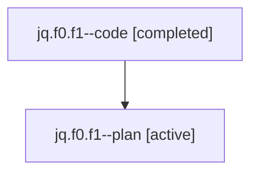

# Family: jq.f0.f1

[Agent Hoods](../README.md) / [bbugyi200](../users/bbugyi200/README.md) / [athena](../users/bbugyi200/machines/athena/README.md) / [jq](../users/bbugyi200/machines/athena/hoods/jq/README.md) / jq.f0.f1

Owner: `bbugyi200.athena` · Hood: `jq` · Members: 2

## Lineage

The diagram is an optional enhancement; the ordered table below contains the same lineage in accessible text.

| Role | Agent | State | Model / provider | Timing | Commits | Prompt | Chat |
|---|---|---|---|---|---:|---|---|
| code | jq.f0.f1--code | completed | gpt-5.6-sol / codex | 2026-07-24T22:57:43.367240+00:00 | [1](../agents/bbugyi200.athena.jq.f0.f1--code/README.md#commits) | — | [Chat](../agents/bbugyi200.athena.jq.f0.f1--code/chat.md) |
| plan | jq.f0.f1--plan | active | gpt-5.6-sol / codex | 2026-07-24T22:51:59.399242+00:00 | 0 | [Prompt](../agents/bbugyi200.athena.jq.f0.f1--plan/prompt.md) | [Chat](../agents/bbugyi200.athena.jq.f0.f1--plan/chat.md) |

## Commits

| Role | Repo | Commit | Subject | Committed |
|---|---|---|---|---|
| code | sase | [`ca348d7`](https://github.com/sase-org/sase/commit/ca348d7034c1887b600464b913d8b29cba304ef9) | feat(ace): show globally queued agent counts | 2026-07-24 19:20:55 EDT |

## Neighbors

| Agent | Relation | State |
|---|---|---|
| [jq.f0](../agents/bbugyi200.athena.jq.f0/README.md) | ancestor | completed |
| [jq](../agents/bbugyi200.athena.jq/README.md) | ancestor | completed |
| [jq.f0.f0](bbugyi200.athena.jq.f0.f0.md) (family · 2) | jq.f0 hood | active 1, completed 1 |
| [jq.f0.f0](../agents/bbugyi200.athena.jq.f0.f0/README.md) | jq.f0 hood | completed |
