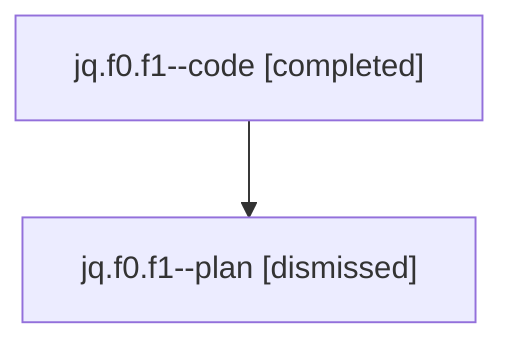

# Family: jq.f0.f1

Owner: `bbugyi200.athena` · Hood: `jq` · Members: 2

## Lineage

The diagram is an optional enhancement; the ordered table below contains the same lineage in accessible text.

| Role | Agent | State | Model / provider | Timing | Commits | Prompt | Chat |
|---|---|---|---|---|---:|---|---|
| code | jq.f0.f1--code | completed | gpt-5.6-sol / codex | 2026-07-24T22:57:43.367240+00:00 | 1 | — | [Chat](../agents/bbugyi200.athena.jq.f0.f1--code/chat.md) |
| plan | jq.f0.f1--plan | dismissed | gpt-5.6-sol / codex | 2026-07-24T18:51:59.399242 → 2026-07-24T19:28:23.790102 | 0 | — | [Chat](../agents/bbugyi200.athena.jq.f0.f1--plan/chat.md) |
