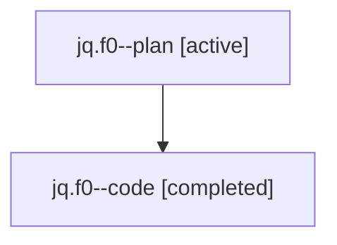

# Family: jq.f0

[Agent Hoods](../README.md) / [bbugyi200](../users/bbugyi200/README.md) / [athena](../users/bbugyi200/machines/athena/README.md) / [jq](../users/bbugyi200/machines/athena/hoods/jq/README.md) / jq.f0

Owner: `bbugyi200.athena` · Hood: `jq` · Members: 2

## Lineage

The diagram is an optional enhancement; the ordered table below contains the same lineage in accessible text.

| Role | Agent | State | Model / provider | Timing | Commits | Prompt | Chat |
|---|---|---|---|---|---:|---|---|
| plan | jq.f0--plan | active | gpt-5.6-sol / codex | 2026-07-24T22:28:29.332829+00:00 | 0 | [Prompt](../agents/bbugyi200.athena.jq.f0--plan/prompt.md) | [Chat](../agents/bbugyi200.athena.jq.f0--plan/chat.md) |
| code | jq.f0--code | completed | gpt-5.6-sol / codex | 2026-07-24T22:31:28.265875+00:00 | [1](../agents/bbugyi200.athena.jq.f0--code/README.md#commits) | — | [Chat](../agents/bbugyi200.athena.jq.f0--code/chat.md) |

## Commits

| Role | Repo | Commit | Subject | Committed (UTC) |
|---|---|---|---|---|
| code | sase | [`f943218`](https://github.com/sase-org/sase/commit/f943218ef38a0eb9a42f7630ddec8ff3f4624394) | fix(tui): highlight agent runner limit | 2026-07-24 22:51:18 |

## Neighbors

| Agent | Relation | State |
|---|---|---|
| [jq](../agents/bbugyi200.athena.jq/README.md) | ancestor | completed |
| [jq.f0.f0](bbugyi200.athena.jq.f0.f0.md) (family · 2) | descendant | active 1, completed 1 |
| [jq.f0.f0](../agents/bbugyi200.athena.jq.f0.f0/README.md) | descendant | completed |
| [jq.f0.f1](bbugyi200.athena.jq.f0.f1.md) (family · 2) | descendant | active 1, completed 1 |
| [jq.f0.f1](../agents/bbugyi200.athena.jq.f0.f1/README.md) | descendant | completed |
