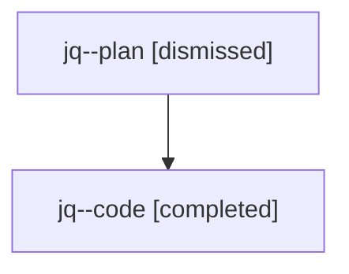

# Family: jq

[Agent Hoods](../README.md) / [bbugyi200](../users/bbugyi200/README.md) / [athena](../users/bbugyi200/machines/athena/README.md) / [jq](../users/bbugyi200/machines/athena/hoods/jq/README.md) / jq

Owner: `bbugyi200.athena` · Hood: `jq` · Members: 2

## Lineage

The diagram is an optional enhancement; the ordered table below contains the same lineage in accessible text.

| Role | Agent | State | Model / provider | Timing | Commits | Prompt | Chat |
|---|---|---|---|---|---:|---|---|
| plan | jq--plan | dismissed | gpt-5.6-sol / codex | 2026-07-24T17:58:32.946519 → 2026-07-24T18:28:24.556918 | 0 | — | [Chat](../agents/bbugyi200.athena.jq--plan/chat.md) |
| code | jq--code | completed | gpt-5.6-sol / codex | 2026-07-24T22:06:37.023476+00:00 | [1](../agents/bbugyi200.athena.jq--code/README.md#commits) | — | [Chat](../agents/bbugyi200.athena.jq--code/chat.md) |

## Commits

| Role | Commit | Subject | Committed (UTC) |
|---|---|---|---|
| code | [`86dc5a0`](https://github.com/sase-org/sase/commit/86dc5a04895671ef29fe61ba695eff1bf6ec7eaa) | feat(ace): consolidate Agents header status counts | 2026-07-24 22:20:05 |

## Neighbors

| Agent | Relation | State |
|---|---|---|
| [jq.f0](bbugyi200.athena.jq.f0.md) (family · 2) | descendant | completed 1, dismissed 1 |
| [jq.f0](../agents/bbugyi200.athena.jq.f0/README.md) | descendant | completed |
| [jq.f0.f0](bbugyi200.athena.jq.f0.f0.md) (family · 2) | descendant | completed 1, dismissed 1 |
| [jq.f0.f0](../agents/bbugyi200.athena.jq.f0.f0/README.md) | descendant | completed |
| [jq.f0.f1](bbugyi200.athena.jq.f0.f1.md) (family · 2) | descendant | completed 1, dismissed 1 |
| [jq.f0.f1](../agents/bbugyi200.athena.jq.f0.f1/README.md) | descendant | completed |
