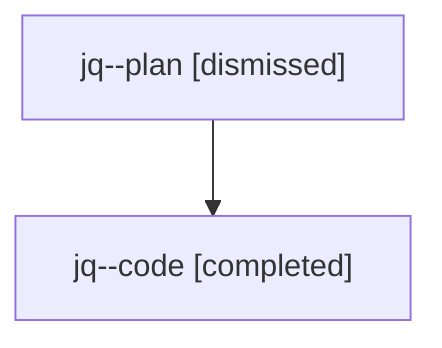

# Family: jq

Owner: `bbugyi200.athena` · Hood: `jq` · Members: 2

## Lineage

The diagram is an optional enhancement; the ordered table below contains the same lineage in accessible text.

| Role | Agent | State | Model / provider | Timing | Commits | Prompt | Chat |
|---|---|---|---|---|---:|---|---|
| plan | jq--plan | dismissed | gpt-5.6-sol / codex | 2026-07-24T17:58:32.946519 → 2026-07-24T18:28:24.556918 | 0 | — | [Chat](../agents/bbugyi200.athena.jq--plan/chat.md) |
| code | jq--code | completed | gpt-5.6-sol / codex | 2026-07-24T22:06:37.023476+00:00 | 1 | — | [Chat](../agents/bbugyi200.athena.jq--code/chat.md) |
