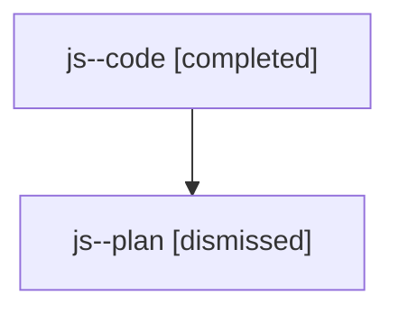

# Family: js

Owner: `bbugyi200.athena` · Hood: `js` · Members: 2

## Lineage

The diagram is an optional enhancement; the ordered table below contains the same lineage in accessible text.

| Role | Agent | State | Model / provider | Timing | Commits | Prompt | Chat |
|---|---|---|---|---|---:|---|---|
| code | js--code | completed | gpt-5.6-sol / codex | 2026-07-24T22:20:05.314544+00:00 | 1 | — | [Chat](../agents/bbugyi200.athena.js--code/chat.md) |
| plan | js--plan | dismissed | gpt-5.6-sol / codex | 2026-07-24T18:13:13.399485 → 2026-07-24T18:45:32.818041 | 0 | — | [Chat](../agents/bbugyi200.athena.js--plan/chat.md) |
