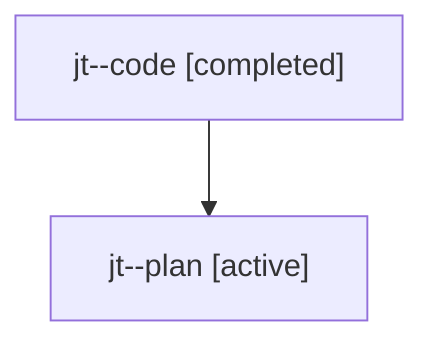

# Family: jt

[Agent Hoods](../README.md) / [bbugyi200](../users/bbugyi200/README.md) / [athena](../users/bbugyi200/machines/athena/README.md) / [jt](../users/bbugyi200/machines/athena/hoods/jt/README.md) / jt

Owner: `bbugyi200.athena` · Hood: `jt` · Members: 2

## Lineage

The diagram is an optional enhancement; the ordered table below contains the same lineage in accessible text.

| Role | Agent | State | Model / provider | Timing | Commits | Prompt | Chat |
|---|---|---|---|---|---:|---|---|
| code | jt--code | completed | gpt-5.6-sol / codex | 2026-07-24T22:34:50.268326+00:00 | [1](../agents/bbugyi200.athena.jt--code/README.md#commits) | — | [Chat](../agents/bbugyi200.athena.jt--code/chat.md) |
| plan | jt--plan | active | gpt-5.6-sol / codex | 2026-07-24T22:28:56.558510+00:00 | 0 | [Prompt](../agents/bbugyi200.athena.jt--plan/prompt.md) | [Chat](../agents/bbugyi200.athena.jt--plan/chat.md) |

## Commits

| Role | Repo | Commit | Subject | Committed |
|---|---|---|---|---|
| code | sase | [`c1fc89c`](https://github.com/sase-org/sase/commit/c1fc89c571ff2607365caef4bcfe527073eb7d9e) | feat(ace): let q close the AXE entry editor | 2026-07-24 19:00:05 EDT |
