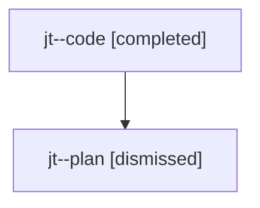

# Family: jt

Owner: `bbugyi200.athena` · Hood: `jt` · Members: 2

## Lineage

The diagram is an optional enhancement; the ordered table below contains the same lineage in accessible text.

| Role | Agent | State | Model / provider | Timing | Commits | Prompt | Chat |
|---|---|---|---|---|---:|---|---|
| code | jt--code | completed | gpt-5.6-sol / codex | 2026-07-24T22:34:50.268326+00:00 | 1 | — | [Chat](../agents/bbugyi200.athena.jt--code/chat.md) |
| plan | jt--plan | dismissed | gpt-5.6-sol / codex | 2026-07-24T18:28:56.558510 → 2026-07-24T19:00:25.939850 | 0 | — | [Chat](../agents/bbugyi200.athena.jt--plan/chat.md) |
