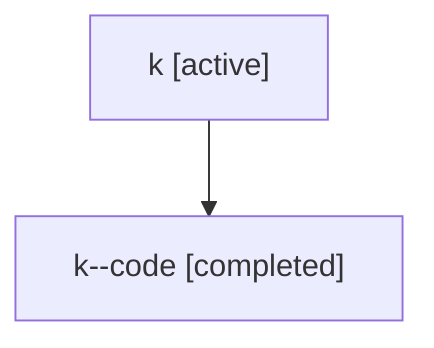

# Family: k

Owner: `bbugyi200.athena` · Hood: `k` · Members: 2

## Lineage

The diagram is an optional enhancement; the ordered table below contains the same lineage in accessible text.

| Role | Agent | State | Model / provider | Timing | Commits | Prompt | Chat |
|---|---|---|---|---|---:|---|---|
| root | k | active | gpt-5.5 / codex | 2026-07-06T19:00:50.887286+00:00 | 2 | [Prompt](../agents/bbugyi200.athena.k/prompt.md) | [Chat](../agents/bbugyi200.athena.k/chat.md) |
| code | k--code | completed | gpt-5.5 / codex | 2026-07-06T19:03:53.506010+00:00 | 1 | — | [Chat](../agents/bbugyi200.athena.k--code/chat.md) |
