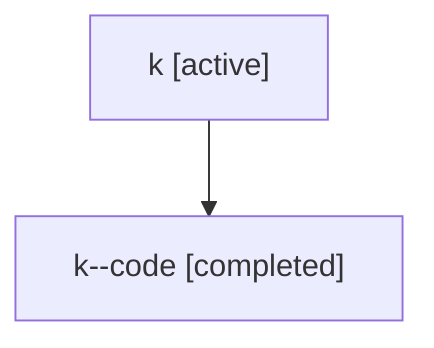

# Family: k

[Agent Hoods](../README.md) / [bbugyi200](../users/bbugyi200/README.md) / [athena](../users/bbugyi200/machines/athena/README.md) / [k](../users/bbugyi200/machines/athena/hoods/k/README.md) / k

Owner: `bbugyi200.athena` · Hood: `k` · Members: 2

## Lineage

The diagram is an optional enhancement; the ordered table below contains the same lineage in accessible text.

| Role | Agent | State | Model / provider | Timing | Commits | Prompt | Chat |
|---|---|---|---|---|---:|---|---|
| root | k | active | gpt-5.5 / codex | 2026-07-06T19:00:50.887286+00:00 | [1](../agents/bbugyi200.athena.k/README.md#commits) | [Prompt](../agents/bbugyi200.athena.k/prompt.md) | [Chat](../agents/bbugyi200.athena.k/chat.md) |
| code | k--code | completed | gpt-5.5 / codex | 2026-07-06T19:03:53.506010+00:00 | [1](../agents/bbugyi200.athena.k--code/README.md#commits) | — | [Chat](../agents/bbugyi200.athena.k--code/chat.md) |

## Commits

| Role | Repo | Commit | Subject | Committed |
|---|---|---|---|---|
| root | sase | [`f56df2e`](https://github.com/sase-org/sase/commit/f56df2e8c8d08bb7ceb8f7cee1a1d1ffcfed1046) | chore: Add SDD prompt and plan for telegram\_update\_workspace\_resolution | 2026-07-06 19:03:52 UTC |
| code | sase | [`60a7b5f`](https://github.com/sase-org/sase/commit/60a7b5fbd9189258d224b1aa3082dde44795cc9f) | fix: resolve chat install workspace through project aliases | 2026-07-06 19:14:24 UTC |
