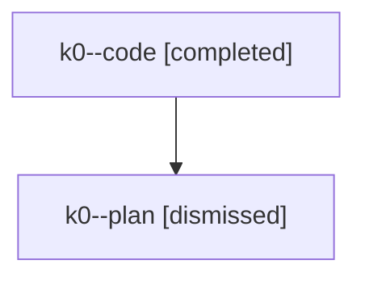

# Family: k0

Owner: `bbugyi200.athena` · Hood: `k0` · Members: 2

## Lineage

The diagram is an optional enhancement; the ordered table below contains the same lineage in accessible text.

| Role | Agent | State | Model / provider | Timing | Commits | Prompt | Chat |
|---|---|---|---|---|---:|---|---|
| code | k0--code | completed | gpt-5.6-sol / codex | 2026-07-25T01:01:31.203737+00:00 | 1 | — | [Chat](../agents/bbugyi200.athena.k0--code/chat.md) |
| plan | k0--plan | dismissed | gpt-5.6-sol / codex | 2026-07-24T20:57:09.143050 → 2026-07-24T21:27:33.209890 | 0 | — | [Chat](../agents/bbugyi200.athena.k0--plan/chat.md) |
