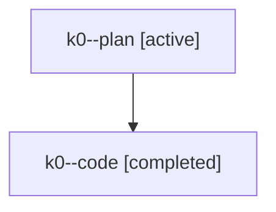

# Family: k0

[Agent Hoods](../README.md) / [bbugyi200](../users/bbugyi200/README.md) / [athena](../users/bbugyi200/machines/athena/README.md) / [k0](../users/bbugyi200/machines/athena/hoods/k0/README.md) / k0

Owner: `bbugyi200.athena` · Hood: `k0` · Members: 2

## Lineage

The diagram is an optional enhancement; the ordered table below contains the same lineage in accessible text.

| Role | Agent | State | Model / provider | Timing | Commits | Prompt | Chat |
|---|---|---|---|---|---:|---|---|
| plan | k0--plan | active | gpt-5.6-sol / codex | 2026-07-25T00:57:09.143050+00:00 | 0 | [Prompt](../agents/bbugyi200.athena.k0--plan/prompt.md) | [Chat](../agents/bbugyi200.athena.k0--plan/chat.md) |
| code | k0--code | completed | gpt-5.6-sol / codex | 2026-07-25T01:01:31.203737+00:00 | [1](../agents/bbugyi200.athena.k0--code/README.md#commits) | — | [Chat](../agents/bbugyi200.athena.k0--code/chat.md) |

## Commits

| Role | Repo | Commit | Subject | Committed |
|---|---|---|---|---|
| code | sase | [`9c40093`](https://github.com/sase-org/sase/commit/9c400939a9202481f53238ea9410d2442d3632b4) | fix(tui): align plan gate clipboard shortcuts | 2026-07-25 01:25:57 UTC |
