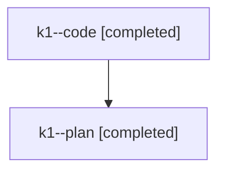

# Family: k1

[Agent Hoods](../README.md) / [bbugyi200](../users/bbugyi200/README.md) / [athena](../users/bbugyi200/machines/athena/README.md) / [k1](../users/bbugyi200/machines/athena/hoods/k1/README.md) / k1

Owner: `bbugyi200.athena` · Hood: `k1` · Members: 2

## Lineage

The diagram is an optional enhancement; the ordered table below contains the same lineage in accessible text.

| Role | Agent | State | Model / provider | Timing | Commits | Prompt | Chat |
|---|---|---|---|---|---:|---|---|
| code | k1--code | completed | gpt-5.6-sol / codex | 2026-07-25T10:35:19.550902+00:00 | [1](../agents/bbugyi200.athena.k1--code/README.md#commits) | — | [Chat](../agents/bbugyi200.athena.k1--code/chat.md) |
| plan | k1--plan | completed | gpt-5.6-sol / codex | 2026-07-25T10:28:15.450563+00:00 | 0 | [Prompt](../agents/bbugyi200.athena.k1--plan/prompt.md) | [Chat](../agents/bbugyi200.athena.k1--plan/chat.md) |

## Commits

| Role | Commit | Subject | Committed (UTC) |
|---|---|---|---|
| code | [`93c58bd`](https://github.com/sase-org/sase/commit/93c58bd88c547aadad4a04e77409777b1edc92a1) | feat(tui): reorder Artifacts tabs by usage | 2026-07-25 11:11:27 |
