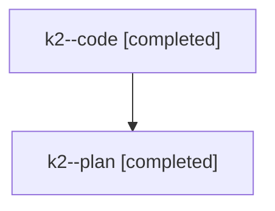

# Family: k2

[Agent Hoods](../README.md) / [bbugyi200](../users/bbugyi200/README.md) / [athena](../users/bbugyi200/machines/athena/README.md) / [k2](../users/bbugyi200/machines/athena/hoods/k2/README.md) / k2

Owner: `bbugyi200.athena` · Hood: `k2` · Members: 2

## Lineage

The diagram is an optional enhancement; the ordered table below contains the same lineage in accessible text.

| Role | Agent | State | Model / provider | Timing | Commits | Prompt | Chat |
|---|---|---|---|---|---:|---|---|
| code | k2--code | completed | gpt-5.6-sol / codex | 2026-07-25T02:19:16.157184+00:00 | [1](../agents/bbugyi200.athena.k2--code/README.md#commits) | — | [Chat](../agents/bbugyi200.athena.k2--code/chat.md) |
| plan | k2--plan | completed | opus / claude | 2026-07-25T01:27:19.350351+00:00 | 0 | [Prompt](../agents/bbugyi200.athena.k2--plan/prompt.md) | [Chat](../agents/bbugyi200.athena.k2--plan/chat.md) |

## Commits

| Role | Commit | Subject | Committed (UTC) |
|---|---|---|---|
| code | [`e40bce9`](https://github.com/sase-org/sase/commit/e40bce924375f7bf7d8690caf9f92c0b1f693e1c) | fix(tui): contain unhandled vim mode keys | 2026-07-25 02:34:17 |
