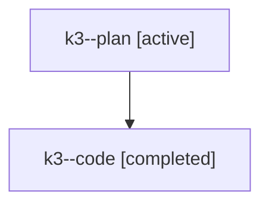

# Family: k3

[Agent Hoods](../README.md) / [bbugyi200](../users/bbugyi200/README.md) / [athena](../users/bbugyi200/machines/athena/README.md) / [k3](../users/bbugyi200/machines/athena/hoods/k3/README.md) / k3

Owner: `bbugyi200.athena` · Hood: `k3` · Members: 2

## Lineage

The diagram is an optional enhancement; the ordered table below contains the same lineage in accessible text.

| Role | Agent | State | Model / provider | Timing | Commits | Prompt | Chat |
|---|---|---|---|---|---:|---|---|
| plan | k3--plan | active | gpt-5.6-sol / codex | 2026-07-25T03:32:50.913972+00:00 | 0 | [Prompt](../agents/bbugyi200.athena.k3--plan/prompt.md) | [Chat](../agents/bbugyi200.athena.k3--plan/chat.md) |
| code | k3--code | completed | gpt-5.6-sol / codex | 2026-07-25T03:42:31.394696+00:00 | [1](../agents/bbugyi200.athena.k3--code/README.md#commits) | — | [Chat](../agents/bbugyi200.athena.k3--code/chat.md) |

## Commits

| Role | Repo | Commit | Subject | Committed (UTC) |
|---|---|---|---|---|
| code | sase | [`80cc705`](https://github.com/sase-org/sase/commit/80cc705f4bd78b9c691d1c220c0d0a466e00944f) | feat(chats): integrate publication state with provenance | 2026-07-25 04:20:36 |
