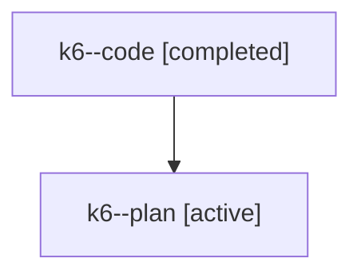

# Family: k6

[Agent Hoods](../README.md) / [bbugyi200](../users/bbugyi200/README.md) / [athena](../users/bbugyi200/machines/athena/README.md) / [k6](../users/bbugyi200/machines/athena/hoods/k6/README.md) / k6

Owner: `bbugyi200.athena` · Hood: `k6` · Members: 2

## Lineage

The diagram is an optional enhancement; the ordered table below contains the same lineage in accessible text.

| Role | Agent | State | Model / provider | Timing | Commits | Prompt | Chat |
|---|---|---|---|---|---:|---|---|
| code | k6--code | completed | gpt-5.6-sol / codex | 2026-07-25T10:52:28.965509+00:00 | [1](../agents/bbugyi200.athena.k6--code/README.md#commits) | — | [Chat](../agents/bbugyi200.athena.k6--code/chat.md) |
| plan | k6--plan | active | opus / claude | 2026-07-25T10:46:08.766487+00:00 | 0 | [Prompt](../agents/bbugyi200.athena.k6--plan/prompt.md) | [Chat](../agents/bbugyi200.athena.k6--plan/chat.md) |

## Commits

| Role | Repo | Commit | Subject | Committed (UTC) |
|---|---|---|---|---|
| code | sase | [`7dd9a0f`](https://github.com/sase-org/sase/commit/7dd9a0fdb0ce23440501965d111a18104e4e8990) | feat(claude): register Claude 5 model metadata | 2026-07-25 10:58:44 |
