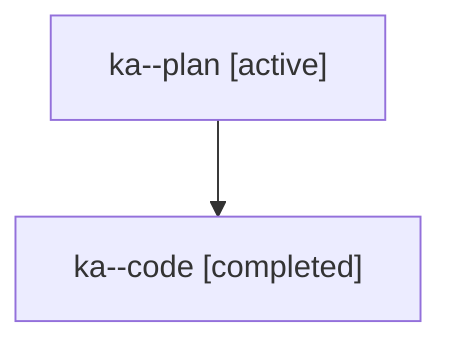

# Family: ka

[Agent Hoods](../README.md) / [bbugyi200](../users/bbugyi200/README.md) / [athena](../users/bbugyi200/machines/athena/README.md) / [ka](../users/bbugyi200/machines/athena/hoods/ka/README.md) / ka

Owner: `bbugyi200.athena` · Hood: `ka` · Members: 2

## Lineage

The diagram is an optional enhancement; the ordered table below contains the same lineage in accessible text.

| Role | Agent | State | Model / provider | Timing | Commits | Prompt | Chat |
|---|---|---|---|---|---:|---|---|
| plan | ka--plan | active | opus / claude | 2026-07-25T11:13:33.094066+00:00 | 0 | [Prompt](../agents/bbugyi200.athena.ka--plan/prompt.md) | [Chat](../agents/bbugyi200.athena.ka--plan/chat.md) |
| code | ka--code | completed | gpt-5.6-sol / codex | 2026-07-25T11:26:31.036721+00:00 | [1](../agents/bbugyi200.athena.ka--code/README.md#commits) | — | [Chat](../agents/bbugyi200.athena.ka--code/chat.md) |

## Commits

| Role | Repo | Commit | Subject | Committed (UTC) |
|---|---|---|---|---|
| code | sase | [`41e44d1`](https://github.com/sase-org/sase/commit/41e44d1c4205f7049723e109c53350460cc36913) | feat(ace): refine top-bar override pills | 2026-07-25 12:53:02 |
