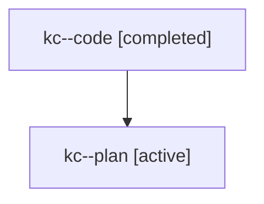

# Family: kc

[Agent Hoods](../README.md) / [bbugyi200](../users/bbugyi200/README.md) / [athena](../users/bbugyi200/machines/athena/README.md) / [kc](../users/bbugyi200/machines/athena/hoods/kc/README.md) / kc

Owner: `bbugyi200.athena` · Hood: `kc` · Members: 2

## Lineage

The diagram is an optional enhancement; the ordered table below contains the same lineage in accessible text.

| Role | Agent | State | Model / provider | Timing | Commits | Prompt | Chat |
|---|---|---|---|---|---:|---|---|
| code | kc--code | completed | gpt-5.6-sol / codex | 2026-07-25T11:43:12.556606+00:00 | [1](../agents/bbugyi200.athena.kc--code/README.md#commits) | — | [Chat](../agents/bbugyi200.athena.kc--code/chat.md) |
| plan | kc--plan | active | opus / claude | 2026-07-25T11:33:00.332763+00:00 | 0 | [Prompt](../agents/bbugyi200.athena.kc--plan/prompt.md) | [Chat](../agents/bbugyi200.athena.kc--plan/chat.md) |

## Commits

| Role | Repo | Commit | Subject | Committed |
|---|---|---|---|---|
| code | sase | [`1892887`](https://github.com/sase-org/sase/commit/18928870295811986d816146b9af5f4679ed91ca) | fix(ace): keep running count color stable | 2026-07-25 12:17:35 UTC |
