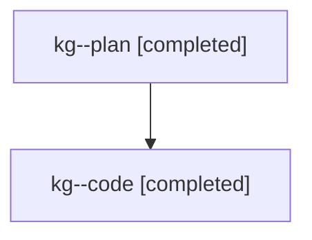

# Family: kg

[Agent Hoods](../README.md) / [bbugyi200](../users/bbugyi200/README.md) / [athena](../users/bbugyi200/machines/athena/README.md) / [kg](../users/bbugyi200/machines/athena/hoods/kg/README.md) / kg

Owner: `bbugyi200.athena` · Hood: `kg` · Members: 2

## Lineage

The diagram is an optional enhancement; the ordered table below contains the same lineage in accessible text.

| Role | Agent | State | Model / provider | Timing | Commits | Prompt | Chat |
|---|---|---|---|---|---:|---|---|
| plan | kg--plan | completed | opus / claude | 2026-07-25T12:11:03.231552+00:00 | 0 | [Prompt](../agents/bbugyi200.athena.kg--plan/prompt.md) | [Chat](../agents/bbugyi200.athena.kg--plan/chat.md) |
| code | kg--code | completed | gpt-5.6-sol / codex | 2026-07-25T12:25:18.446407+00:00 | [1](../agents/bbugyi200.athena.kg--code/README.md#commits) | — | [Chat](../agents/bbugyi200.athena.kg--code/chat.md) |

## Commits

| Role | Commit | Subject | Committed (UTC) |
|---|---|---|---|
| code | [`0846479`](https://github.com/sase-org/sase/commit/084647975d1ba6e239c0697b839ab40e65ed544a) | feat(ace): support insert-mode bullet indentation | 2026-07-25 14:17:16 |
