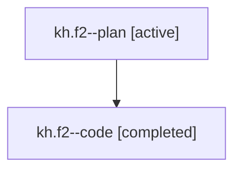

# Family: kh.f2

[Agent Hoods](../README.md) / [bbugyi200](../users/bbugyi200/README.md) / [athena](../users/bbugyi200/machines/athena/README.md) / [kh](../users/bbugyi200/machines/athena/hoods/kh/README.md) / kh.f2

Owner: `bbugyi200.athena` · Hood: `kh` · Members: 2

## Lineage

The diagram is an optional enhancement; the ordered table below contains the same lineage in accessible text.

| Role | Agent | State | Model / provider | Timing | Commits | Prompt | Chat |
|---|---|---|---|---|---:|---|---|
| plan | kh.f2--plan | active | opus / claude | 2026-07-25T13:35:47.140447+00:00 | 0 | [Prompt](../agents/bbugyi200.athena.kh.f2--plan/prompt.md) | [Chat](../agents/bbugyi200.athena.kh.f2--plan/chat.md) |
| code | kh.f2--code | completed | gpt-5.6-sol / codex | 2026-07-25T13:43:41.098005+00:00 | [1](../agents/bbugyi200.athena.kh.f2--code/README.md#commits) | — | [Chat](../agents/bbugyi200.athena.kh.f2--code/chat.md) |

## Commits

| Role | Commit | Subject | Committed (UTC) |
|---|---|---|---|
| code | [`b1b5db1`](https://github.com/sase-org/sase/commit/b1b5db1fd7392a731ffdf7ec3c0fb848a7489498) | fix(ace): exclude queued agents from waiting counts | 2026-07-25 14:26:53 |

## Neighbors

| Agent | Relation | State |
|---|---|---|
| [kh](../agents/bbugyi200.athena.kh/README.md) | ancestor | completed |
| [kh.f0](../agents/bbugyi200.athena.kh.f0/README.md) | kh hood | waiting |
| [kh.f1](../agents/bbugyi200.athena.kh.f1/README.md) | kh hood | active |
