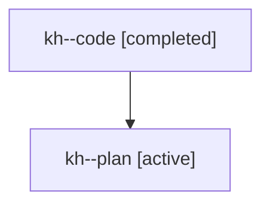

# Family: kh

[Agent Hoods](../README.md) / [bbugyi200](../users/bbugyi200/README.md) / [athena](../users/bbugyi200/machines/athena/README.md) / [kh](../users/bbugyi200/machines/athena/hoods/kh/README.md) / kh

Owner: `bbugyi200.athena` · Hood: `kh` · Members: 2

## Lineage

The diagram is an optional enhancement; the ordered table below contains the same lineage in accessible text.

| Role | Agent | State | Model / provider | Timing | Commits | Prompt | Chat |
|---|---|---|---|---|---:|---|---|
| code | kh--code | completed | gpt-5.6-sol / codex | 2026-07-25T12:27:34.767440+00:00 | [1](../agents/bbugyi200.athena.kh--code/README.md#commits) | — | [Chat](../agents/bbugyi200.athena.kh--code/chat.md) |
| plan | kh--plan | active | opus / claude | 2026-07-25T12:18:20.238501+00:00 | 0 | [Prompt](../agents/bbugyi200.athena.kh--plan/prompt.md) | [Chat](../agents/bbugyi200.athena.kh--plan/chat.md) |

## Commits

| Role | Repo | Commit | Subject | Committed |
|---|---|---|---|---|
| code | sase | [`53d36a2`](https://github.com/sase-org/sase/commit/53d36a2980bd3930de103ccc65f94c4117f59f39) | fix(ace): omit queued chip from leaf agent rows | 2026-07-25 08:58:20 EDT |

## Neighbors

| Agent | Relation | State |
|---|---|---|
| [kh.f0](../agents/bbugyi200.athena.kh.f0/README.md) | descendant | waiting |
| [kh.f1](../agents/bbugyi200.athena.kh.f1/README.md) | descendant | dismissed |
| [kh.f2](bbugyi200.athena.kh.f2.md) (family · 2) | descendant | active 1, completed 1 |
| [kh.f2](../agents/bbugyi200.athena.kh.f2/README.md) | descendant | completed |
