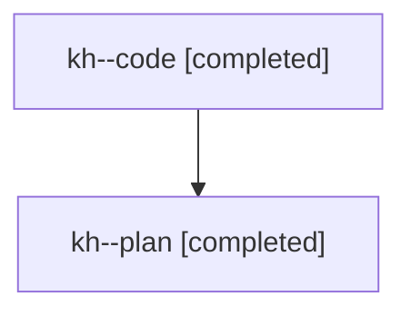

# Family: kh

Owner: `bbugyi200.athena` · Hood: `kh` · Members: 2

## Lineage

The diagram is an optional enhancement; the ordered table below contains the same lineage in accessible text.

| Role | Agent | State | Model / provider | Timing | Commits | Prompt | Chat |
|---|---|---|---|---|---:|---|---|
| code | kh--code | completed | gpt-5.6-sol / codex | 2026-07-25T12:27:34.767440+00:00 | 1 | — | [Chat](../agents/bbugyi200.athena.kh--code/chat.md) |
| plan | kh--plan | completed | opus / claude | 2026-07-25T12:18:20.238501+00:00 | 0 | [Prompt](../agents/bbugyi200.athena.kh--plan/prompt.md) | [Chat](../agents/bbugyi200.athena.kh--plan/chat.md) |
