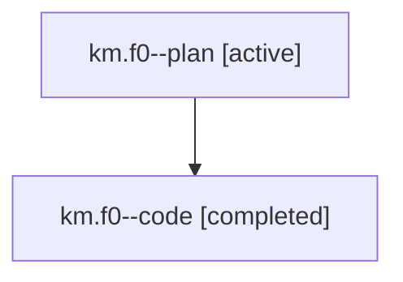

# Family: km.f0

[Agent Hoods](../README.md) / [bbugyi200](../users/bbugyi200/README.md) / [athena](../users/bbugyi200/machines/athena/README.md) / [km](../users/bbugyi200/machines/athena/hoods/km/README.md) / km.f0

Owner: `bbugyi200.athena` · Hood: `km` · Members: 2

## Lineage

The diagram is an optional enhancement; the ordered table below contains the same lineage in accessible text.

| Role | Agent | State | Model / provider | Timing | Commits | Prompt | Chat |
|---|---|---|---|---|---:|---|---|
| plan | km.f0--plan | active | opus / claude | 2026-07-25T15:07:00.680821+00:00 | 0 | [Prompt](../agents/bbugyi200.athena.km.f0--plan/prompt.md) | [Chat](../agents/bbugyi200.athena.km.f0--plan/chat.md) |
| code | km.f0--code | completed | gpt-5.6-sol / codex | 2026-07-25T15:17:48.313470+00:00 | [1](../agents/bbugyi200.athena.km.f0--code/README.md#commits) | — | [Chat](../agents/bbugyi200.athena.km.f0--code/chat.md) |

## Commits

| Role | Repo | Commit | Subject | Committed |
|---|---|---|---|---|
| code | sase | [`a0b40ef`](https://github.com/sase-org/sase/commit/a0b40ef37c1ec7afd8581fb31dd38ff0ca372937) | fix: propagate default overrides through alias resolution | 2026-07-25 11:46:36 EDT |

## Neighbors

| Agent | Relation | State |
|---|---|---|
| [km](../agents/bbugyi200.athena.km/README.md) | ancestor | completed |
