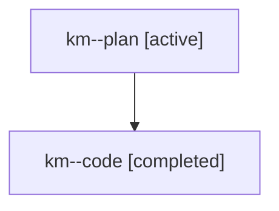

# Family: km

[Agent Hoods](../README.md) / [bbugyi200](../users/bbugyi200/README.md) / [athena](../users/bbugyi200/machines/athena/README.md) / [km](../users/bbugyi200/machines/athena/hoods/km/README.md) / km

Owner: `bbugyi200.athena` · Hood: `km` · Members: 2

## Lineage

The diagram is an optional enhancement; the ordered table below contains the same lineage in accessible text.

| Role | Agent | State | Model / provider | Timing | Commits | Prompt | Chat |
|---|---|---|---|---|---:|---|---|
| plan | km--plan | active | opus / claude | 2026-07-25T13:47:19.563049+00:00 | 0 | [Prompt](../agents/bbugyi200.athena.km--plan/prompt.md) | [Chat](../agents/bbugyi200.athena.km--plan/chat.md) |
| code | km--code | completed | gpt-5.6-sol / codex | 2026-07-25T13:59:05.138756+00:00 | [1](../agents/bbugyi200.athena.km--code/README.md#commits) | — | [Chat](../agents/bbugyi200.athena.km--code/chat.md) |

## Commits

| Role | Repo | Commit | Subject | Committed (UTC) |
|---|---|---|---|---|
| code | sase | [`e0f310d`](https://github.com/sase-org/sase/commit/e0f310d8da7a01c7e67aac9e030582ab746b9b22) | feat(models): make medium phase worker follow default | 2026-07-25 15:00:21 |

## Neighbors

| Agent | Relation | State |
|---|---|---|
| [km.f0](bbugyi200.athena.km.f0.md) (family · 2) | descendant | active 1, completed 1 |
| [km.f0](../agents/bbugyi200.athena.km.f0/README.md) | descendant | completed |
