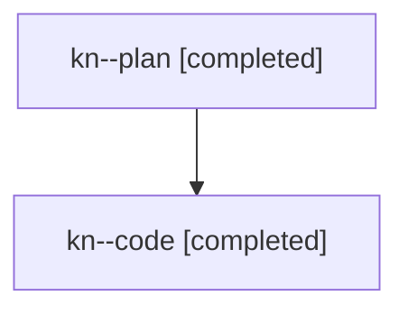

# Family: kn

Owner: `bbugyi200.athena` · Hood: `kn` · Members: 2

## Lineage

The diagram is an optional enhancement; the ordered table below contains the same lineage in accessible text.

| Role | Agent | State | Model / provider | Timing | Commits | Prompt | Chat |
|---|---|---|---|---|---:|---|---|
| plan | kn--plan | completed | opus / claude | 2026-07-25T13:49:11.402882+00:00 | 0 | [Prompt](../agents/bbugyi200.athena.kn--plan/prompt.md) | [Chat](../agents/bbugyi200.athena.kn--plan/chat.md) |
| code | kn--code | completed | gpt-5.6-sol / codex | 2026-07-25T13:53:30.645021+00:00 | 1 | — | [Chat](../agents/bbugyi200.athena.kn--code/chat.md) |
