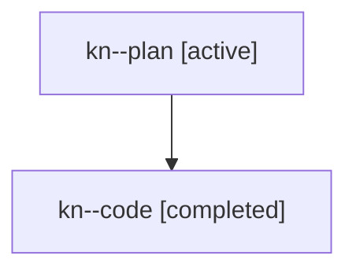

# Family: kn

[Agent Hoods](../README.md) / [bbugyi200](../users/bbugyi200/README.md) / [athena](../users/bbugyi200/machines/athena/README.md) / [kn](../users/bbugyi200/machines/athena/hoods/kn/README.md) / kn

Owner: `bbugyi200.athena` · Hood: `kn` · Members: 2

## Lineage

The diagram is an optional enhancement; the ordered table below contains the same lineage in accessible text.

| Role | Agent | State | Model / provider | Timing | Commits | Prompt | Chat |
|---|---|---|---|---|---:|---|---|
| plan | kn--plan | active | opus / claude | 2026-07-25T13:49:11.402882+00:00 | 0 | [Prompt](../agents/bbugyi200.athena.kn--plan/prompt.md) | [Chat](../agents/bbugyi200.athena.kn--plan/chat.md) |
| code | kn--code | completed | gpt-5.6-sol / codex | 2026-07-25T13:53:30.645021+00:00 | [1](../agents/bbugyi200.athena.kn--code/README.md#commits) | — | [Chat](../agents/bbugyi200.athena.kn--code/chat.md) |

## Commits

| Role | Repo | Commit | Subject | Committed |
|---|---|---|---|---|
| code | sase | [`396e272`](https://github.com/sase-org/sase/commit/396e27268fe1ba4e4411e851375e1451ee80c296) | fix: preserve bead notes during commit workflows | 2026-07-25 10:13:21 EDT |
