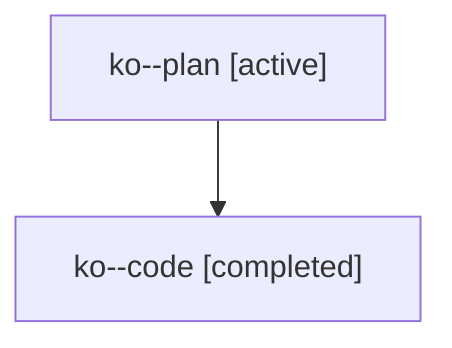

# Family: ko

[Agent Hoods](../README.md) / [bbugyi200](../users/bbugyi200/README.md) / [athena](../users/bbugyi200/machines/athena/README.md) / [ko](../users/bbugyi200/machines/athena/hoods/ko/README.md) / ko

Owner: `bbugyi200.athena` · Hood: `ko` · Members: 2

## Lineage

The diagram is an optional enhancement; the ordered table below contains the same lineage in accessible text.

| Role | Agent | State | Model / provider | Timing | Commits | Prompt | Chat |
|---|---|---|---|---|---:|---|---|
| plan | ko--plan | active | opus / claude | 2026-07-25T14:04:40.520268+00:00 | 0 | [Prompt](../agents/bbugyi200.athena.ko--plan/prompt.md) | [Chat](../agents/bbugyi200.athena.ko--plan/chat.md) |
| code | ko--code | completed | gpt-5.6-sol / codex | 2026-07-25T14:13:30.559827+00:00 | [1](../agents/bbugyi200.athena.ko--code/README.md#commits) | — | [Chat](../agents/bbugyi200.athena.ko--code/chat.md) |

## Commits

| Role | Repo | Commit | Subject | Committed |
|---|---|---|---|---|
| code | sase | [`7f688d0`](https://github.com/sase-org/sase/commit/7f688d070d0240af65bd82379d47bb4c69f356c6) | fix(notifications): dismiss settled gate notifications | 2026-07-25 14:32:17 UTC |
