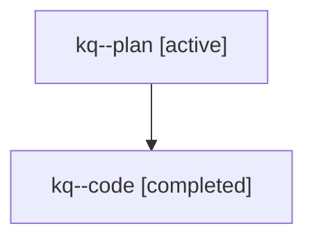

# Family: kq

[Agent Hoods](../README.md) / [bbugyi200](../users/bbugyi200/README.md) / [athena](../users/bbugyi200/machines/athena/README.md) / [kq](../users/bbugyi200/machines/athena/hoods/kq/README.md) / kq

Owner: `bbugyi200.athena` · Hood: `kq` · Members: 2

## Lineage

The diagram is an optional enhancement; the ordered table below contains the same lineage in accessible text.

| Role | Agent | State | Model / provider | Timing | Commits | Prompt | Chat |
|---|---|---|---|---|---:|---|---|
| plan | kq--plan | active | opus / claude | 2026-07-25T14:28:13.598843+00:00 | 0 | [Prompt](../agents/bbugyi200.athena.kq--plan/prompt.md) | [Chat](../agents/bbugyi200.athena.kq--plan/chat.md) |
| code | kq--code | completed | gpt-5.6-sol / codex | 2026-07-25T14:37:37.698924+00:00 | [1](../agents/bbugyi200.athena.kq--code/README.md#commits) | — | [Chat](../agents/bbugyi200.athena.kq--code/chat.md) |

## Commits

| Role | Repo | Commit | Subject | Committed |
|---|---|---|---|---|
| code | sase | [`266eac0`](https://github.com/sase-org/sase/commit/266eac076ab2986a6153fd5f2818761d4b11d109) | feat(ace): add tribe-scoped fold hints | 2026-07-25 11:22:41 EDT |
