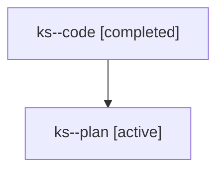

# Family: ks

[Agent Hoods](../README.md) / [bbugyi200](../users/bbugyi200/README.md) / [athena](../users/bbugyi200/machines/athena/README.md) / [ks](../users/bbugyi200/machines/athena/hoods/ks/README.md) / ks

Owner: `bbugyi200.athena` · Hood: `ks` · Members: 2

## Lineage

The diagram is an optional enhancement; the ordered table below contains the same lineage in accessible text.

| Role | Agent | State | Model / provider | Timing | Commits | Prompt | Chat |
|---|---|---|---|---|---:|---|---|
| code | ks--code | completed | gpt-5.6-sol / codex | 2026-07-25T15:05:36.867555+00:00 | [1](../agents/bbugyi200.athena.ks--code/README.md#commits) | — | [Chat](../agents/bbugyi200.athena.ks--code/chat.md) |
| plan | ks--plan | active | opus / claude | 2026-07-25T14:57:26.907851+00:00 | 0 | [Prompt](../agents/bbugyi200.athena.ks--plan/prompt.md) | [Chat](../agents/bbugyi200.athena.ks--plan/chat.md) |

## Commits

| Role | Repo | Commit | Subject | Committed (UTC) |
|---|---|---|---|---|
| code | sase | [`178f5d5`](https://github.com/sase-org/sase/commit/178f5d53fd7228e8363cfd1ce7adf594bb6127ac) | fix(ace): skip collapsed tribe panels during jumps | 2026-07-25 15:32:42 |
