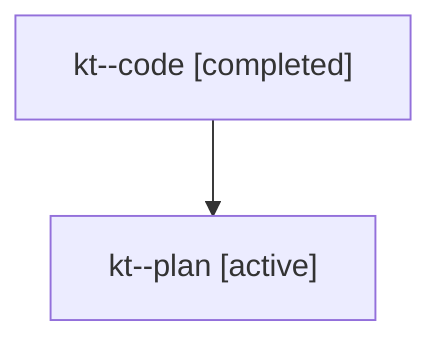

# Family: kt

[Agent Hoods](../README.md) / [bbugyi200](../users/bbugyi200/README.md) / [athena](../users/bbugyi200/machines/athena/README.md) / [kt](../users/bbugyi200/machines/athena/hoods/kt/README.md) / kt

Owner: `bbugyi200.athena` · Hood: `kt` · Members: 2

## Lineage

The diagram is an optional enhancement; the ordered table below contains the same lineage in accessible text.

| Role | Agent | State | Model / provider | Timing | Commits | Prompt | Chat |
|---|---|---|---|---|---:|---|---|
| code | kt--code | completed | gpt-5.6-sol / codex | 2026-07-25T15:17:23.715698+00:00 | [1](../agents/bbugyi200.athena.kt--code/README.md#commits) | — | [Chat](../agents/bbugyi200.athena.kt--code/chat.md) |
| plan | kt--plan | active | opus / claude | 2026-07-25T15:01:13.964778+00:00 | 0 | [Prompt](../agents/bbugyi200.athena.kt--plan/prompt.md) | [Chat](../agents/bbugyi200.athena.kt--plan/chat.md) |

## Commits

| Role | Repo | Commit | Subject | Committed (UTC) |
|---|---|---|---|---|
| code | sase | [`c0f1c6e`](https://github.com/sase-org/sase/commit/c0f1c6e5a3c775ee314a6ca14c16ca5913b83d05) | fix(ace): prevent quit hangs on in-flight workers | 2026-07-25 15:46:39 |
