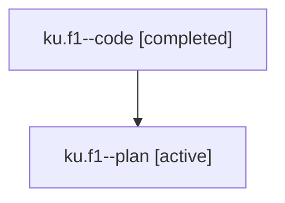

# Family: ku.f1

[Agent Hoods](../README.md) / [bbugyi200](../users/bbugyi200/README.md) / [athena](../users/bbugyi200/machines/athena/README.md) / [ku](../users/bbugyi200/machines/athena/hoods/ku/README.md) / ku.f1

Owner: `bbugyi200.athena` · Hood: `ku` · Members: 2

## Lineage

The diagram is an optional enhancement; the ordered table below contains the same lineage in accessible text.

| Role | Agent | State | Model / provider | Timing | Commits | Prompt | Chat |
|---|---|---|---|---|---:|---|---|
| code | ku.f1--code | completed | gpt-5.6-sol / codex | 2026-07-25T16:56:00.184155+00:00 | [1](../agents/bbugyi200.athena.ku.f1--code/README.md#commits) | — | [Chat](../agents/bbugyi200.athena.ku.f1--code/chat.md) |
| plan | ku.f1--plan | active | opus / claude | 2026-07-25T16:45:09.351023+00:00 | 0 | [Prompt](../agents/bbugyi200.athena.ku.f1--plan/prompt.md) | [Chat](../agents/bbugyi200.athena.ku.f1--plan/chat.md) |

## Commits

| Role | Repo | Commit | Subject | Committed (UTC) |
|---|---|---|---|---|
| code | sase | [`0218ce8`](https://github.com/sase-org/sase/commit/0218ce832fe25ebf5452d8dcc8210a163d12a142) | feat(ace): show runner queue position context | 2026-07-25 18:59:24 |

## Neighbors

| Agent | Relation | State |
|---|---|---|
| [ku](../agents/bbugyi200.athena.ku/README.md) | ancestor | completed |
| [ku.f1.w0](../agents/bbugyi200.athena.ku.f1.w0/README.md) | descendant | waiting |
