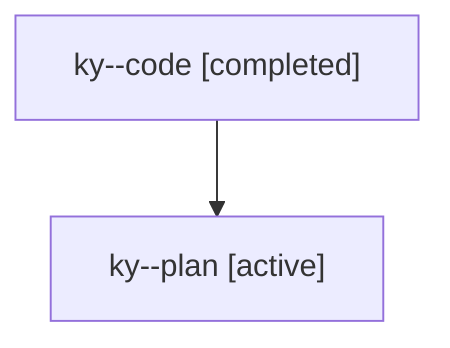

# Family: ky

[Agent Hoods](../README.md) / [bbugyi200](../users/bbugyi200/README.md) / [athena](../users/bbugyi200/machines/athena/README.md) / [ky](../users/bbugyi200/machines/athena/hoods/ky/README.md) / ky

Owner: `bbugyi200.athena` · Hood: `ky` · Members: 2

## Lineage

The diagram is an optional enhancement; the ordered table below contains the same lineage in accessible text.

| Role | Agent | State | Model / provider | Timing | Commits | Prompt | Chat |
|---|---|---|---|---|---:|---|---|
| code | ky--code | completed | gpt-5.6-sol / codex | 2026-07-25T17:18:20.470689+00:00 | [1](../agents/bbugyi200.athena.ky--code/README.md#commits) | — | [Chat](../agents/bbugyi200.athena.ky--code/chat.md) |
| plan | ky--plan | active | opus / claude | 2026-07-25T17:13:08.996531+00:00 | 0 | [Prompt](../agents/bbugyi200.athena.ky--plan/prompt.md) | [Chat](../agents/bbugyi200.athena.ky--plan/chat.md) |

## Commits

| Role | Repo | Commit | Subject | Committed |
|---|---|---|---|---|
| code | sase | [`14bf5f1`](https://github.com/sase-org/sase/commit/14bf5f15c169579fe947609236c23f7d77ccb6f4) | feat(llm-provider)!: retire epic\_creator model alias | 2026-07-25 14:21:45 EDT |
