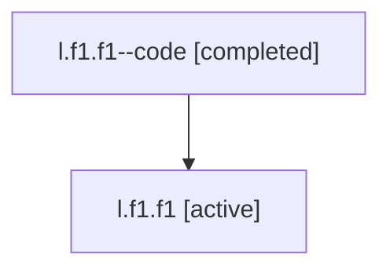

# Family: l.f1.f1

[Agent Hoods](../README.md) / [bbugyi200](../users/bbugyi200/README.md) / [athena](../users/bbugyi200/machines/athena/README.md) / [l](../users/bbugyi200/machines/athena/hoods/l/README.md) / l.f1.f1

Owner: `bbugyi200.athena` · Hood: `l` · Members: 2

## Lineage

The diagram is an optional enhancement; the ordered table below contains the same lineage in accessible text.

| Role | Agent | State | Model / provider | Timing | Commits | Prompt | Chat |
|---|---|---|---|---|---:|---|---|
| code | l.f1.f1--code | completed | gpt-5.5 / codex | 2026-07-06T20:51:47.940510+00:00 | 0 | — | [Chat](../agents/bbugyi200.athena.l.f1.f1--code/chat.md) |
| root | l.f1.f1 | active | claude-fable-5 / claude | 2026-07-06T20:44:07.271672+00:00 | [2](../agents/bbugyi200.athena.l.f1.f1/README.md#commits) | [Prompt](../agents/bbugyi200.athena.l.f1.f1/prompt.md) | [Chat](../agents/bbugyi200.athena.l.f1.f1/chat.md) |

## Commits

| Role | Repo | Commit | Subject | Committed (UTC) |
|---|---|---|---|---|
| root | sase | [`64bbbca`](https://github.com/sase-org/sase/commit/64bbbcaf6734d99bac329f88397569058188da2e) | chore: Add SDD prompt and plan for video\_artifact\_preview | 2026-07-06 20:51:46 |
| root | sase | [`e49c4e1`](https://github.com/sase-org/sase/commit/e49c4e13698a4b703c3e2b0e56178b0a7a0b8ef6) | feat(ace): preview video artifacts with mpv | 2026-07-06 21:10:15 |

## Neighbors

| Agent | Relation | State |
|---|---|---|
| [l.f1](bbugyi200.athena.l.f1.md) (family · 2) | ancestor | active 1, completed 1 |
| [l](bbugyi200.athena.l.md) (family · 2) | ancestor | active 1, completed 1 |
