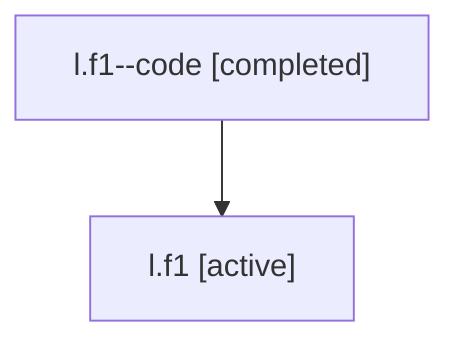

# Family: l.f1

[Agent Hoods](../README.md) / [bbugyi200](../users/bbugyi200/README.md) / [athena](../users/bbugyi200/machines/athena/README.md) / [l](../users/bbugyi200/machines/athena/hoods/l/README.md) / l.f1

Owner: `bbugyi200.athena` · Hood: `l` · Members: 2

## Lineage

The diagram is an optional enhancement; the ordered table below contains the same lineage in accessible text.

| Role | Agent | State | Model / provider | Timing | Commits | Prompt | Chat |
|---|---|---|---|---|---:|---|---|
| code | l.f1--code | completed | gpt-5.5 / codex | 2026-07-06T20:33:37.657620+00:00 | 0 | — | [Chat](../agents/bbugyi200.athena.l.f1--code/chat.md) |
| root | l.f1 | active | gpt-5.5 / codex | 2026-07-06T20:29:46.442857+00:00 | [2](../agents/bbugyi200.athena.l.f1/README.md#commits) | [Prompt](../agents/bbugyi200.athena.l.f1/prompt.md) | [Chat](../agents/bbugyi200.athena.l.f1/chat.md) |

## Commits

| Role | Repo | Commit | Subject | Committed (UTC) |
|---|---|---|---|---|
| root | sase | [`e1b2d2e`](https://github.com/sase-org/sase/commit/e1b2d2efb5a3bd955922e0b4c365ea43962727ea) | chore: Add SDD prompt and plan for generated\_media\_default\_artifacts | 2026-07-06 20:33:36 |
| root | sase | [`0047ef8`](https://github.com/sase-org/sase/commit/0047ef832725c6d8b33abf89d0173e98a3b0cf18) | fix: persist prompt-referenced videos as artifacts | 2026-07-06 20:43:38 |

## Neighbors

| Agent | Relation | State |
|---|---|---|
| [l](bbugyi200.athena.l.md) (family · 2) | ancestor | active 1, completed 1 |
| [l.f1.f1](bbugyi200.athena.l.f1.f1.md) (family · 2) | descendant | active 1, completed 1 |
