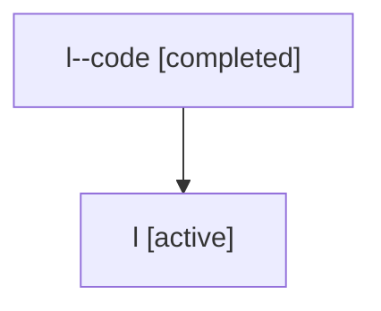

# Family: l

[Agent Hoods](../README.md) / [bbugyi200](../users/bbugyi200/README.md) / [athena](../users/bbugyi200/machines/athena/README.md) / [l](../users/bbugyi200/machines/athena/hoods/l/README.md) / l

Owner: `bbugyi200.athena` · Hood: `l` · Members: 2

## Lineage

The diagram is an optional enhancement; the ordered table below contains the same lineage in accessible text.

| Role | Agent | State | Model / provider | Timing | Commits | Prompt | Chat |
|---|---|---|---|---|---:|---|---|
| code | l--code | completed | gpt-5.5 / codex | 2026-07-06T19:50:07.120758+00:00 | [1](../agents/bbugyi200.athena.l--code/README.md#commits) | — | [Chat](../agents/bbugyi200.athena.l--code/chat.md) |
| root | l | active | gpt-5.5 / codex | 2026-07-06T19:45:09.961253+00:00 | [1](../agents/bbugyi200.athena.l/README.md#commits) | [Prompt](../agents/bbugyi200.athena.l/prompt.md) | [Chat](../agents/bbugyi200.athena.l/chat.md) |

## Commits

| Role | Repo | Commit | Subject | Committed |
|---|---|---|---|---|
| root | sase | [`0497e9b`](https://github.com/sase-org/sase/commit/0497e9b0c85b242b8263adfc2018fae19cabd1d7) | chore: Add SDD prompt and plan for telegram\_completion\_media\_attachments | 2026-07-06 15:50:05 EDT |
| code | sase | [`e746e59`](https://github.com/sase-org/sase/commit/e746e59d2a517804f250077ae9eb90cddf2ff39b) | feat: attach generated videos to agent completions | 2026-07-06 16:25:42 EDT |

## Neighbors

| Agent | Relation | State |
|---|---|---|
| [l.f1](bbugyi200.athena.l.f1.md) (family · 2) | descendant | active 1, completed 1 |
| [l.f1.f1](bbugyi200.athena.l.f1.f1.md) (family · 2) | descendant | active 1, completed 1 |
