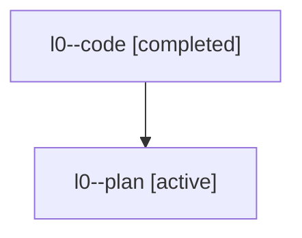

# Family: l0

[Agent Hoods](../README.md) / [bbugyi200](../users/bbugyi200/README.md) / [athena](../users/bbugyi200/machines/athena/README.md) / [l0](../users/bbugyi200/machines/athena/hoods/l0/README.md) / l0

Owner: `bbugyi200.athena` · Hood: `l0` · Members: 2

## Lineage

The diagram is an optional enhancement; the ordered table below contains the same lineage in accessible text.

| Role | Agent | State | Model / provider | Timing | Commits | Prompt | Chat |
|---|---|---|---|---|---:|---|---|
| code | l0--code | completed | opus / claude | 2026-07-25T18:20:55.325962+00:00 | [1](../agents/bbugyi200.athena.l0--code/README.md#commits) | — | [Chat](../agents/bbugyi200.athena.l0--code/chat.md) |
| plan | l0--plan | active | opus / claude | 2026-07-25T18:15:13.468880+00:00 | 0 | [Prompt](../agents/bbugyi200.athena.l0--plan/prompt.md) | [Chat](../agents/bbugyi200.athena.l0--plan/chat.md) |

## Commits

| Role | Repo | Commit | Subject | Committed |
|---|---|---|---|---|
| code | sase | [`6c4b65f`](https://github.com/sase-org/sase/commit/6c4b65f7bd0a1339d62af6b63c47f42febe1bfef) | fix(ace): keep prompt Ctrl+J from clearing a lone empty bullet | 2026-07-25 18:46:13 UTC |
