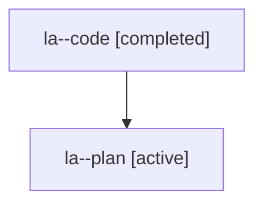

# Family: la

[Agent Hoods](../README.md) / [bbugyi200](../users/bbugyi200/README.md) / [athena](../users/bbugyi200/machines/athena/README.md) / [la](../users/bbugyi200/machines/athena/hoods/la/README.md) / la

Owner: `bbugyi200.athena` · Hood: `la` · Members: 2

## Lineage

The diagram is an optional enhancement; the ordered table below contains the same lineage in accessible text.

| Role | Agent | State | Model / provider | Timing | Commits | Prompt | Chat |
|---|---|---|---|---|---:|---|---|
| code | la--code | completed | gpt-5.6-sol / codex | 2026-07-26T11:35:56.132796+00:00 | [1](../agents/bbugyi200.athena.la--code/README.md#commits) | — | [Chat](../agents/bbugyi200.athena.la--code/chat.md) |
| plan | la--plan | active | opus / claude | 2026-07-26T11:21:56.630043+00:00 | 0 | [Prompt](../agents/bbugyi200.athena.la--plan/prompt.md) | [Chat](../agents/bbugyi200.athena.la--plan/chat.md) |

## Commits

| Role | Repo | Commit | Subject | Committed (UTC) |
|---|---|---|---|---|
| code | sase | [`f429d11`](https://github.com/sase-org/sase/commit/f429d118c2433f99522be4e6a7138aa071f5ea6e) | fix: refresh bead stores for active waiters | 2026-07-26 12:35:24 |
