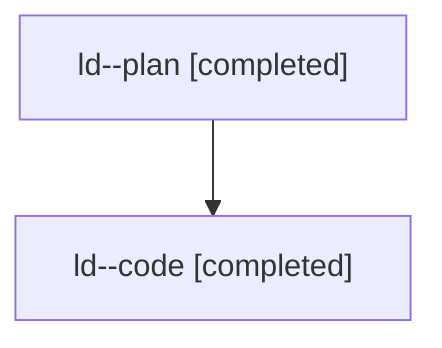

# Family: ld

[Agent Hoods](../README.md) / [bbugyi200](../users/bbugyi200/README.md) / [athena](../users/bbugyi200/machines/athena/README.md) / [ld](../users/bbugyi200/machines/athena/hoods/ld/README.md) / ld

Owner: `bbugyi200.athena` · Hood: `ld` · Members: 2

## Lineage

The diagram is an optional enhancement; the ordered table below contains the same lineage in accessible text.

| Role | Agent | State | Model / provider | Timing | Commits | Prompt | Chat |
|---|---|---|---|---|---:|---|---|
| plan | ld--plan | completed | gpt-5.6-sol / codex | 2026-07-26T11:40:05.536431+00:00 | 0 | [Prompt](../agents/bbugyi200.athena.ld--plan/prompt.md) | [Chat](../agents/bbugyi200.athena.ld--plan/chat.md) |
| code | ld--code | completed | gpt-5.6-sol / codex | 2026-07-26T11:52:27.349490+00:00 | [1](../agents/bbugyi200.athena.ld--code/README.md#commits) | — | [Chat](../agents/bbugyi200.athena.ld--code/chat.md) |

## Commits

| Role | Commit | Subject | Committed (UTC) |
|---|---|---|---|
| code | [`30f3a22`](https://github.com/sase-org/sase/commit/30f3a22c86d445f7be5560bc7e9a966286c1bd60) | fix(ace): prioritize queued clan status | 2026-07-26 12:22:28 |
