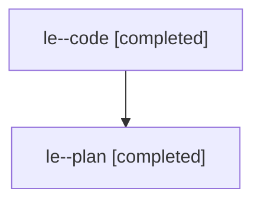

# Family: le

Owner: `bbugyi200.athena` · Hood: `le` · Members: 2

## Lineage

The diagram is an optional enhancement; the ordered table below contains the same lineage in accessible text.

| Role | Agent | State | Model / provider | Timing | Commits | Prompt | Chat |
|---|---|---|---|---|---:|---|---|
| code | le--code | completed | gpt-5.6-sol / codex | 2026-07-26T11:55:43.735818+00:00 | 1 | — | [Chat](../agents/bbugyi200.athena.le--code/chat.md) |
| plan | le--plan | completed | gpt-5.6-sol / codex | 2026-07-26T11:51:03.114713+00:00 | 0 | [Prompt](../agents/bbugyi200.athena.le--plan/prompt.md) | [Chat](../agents/bbugyi200.athena.le--plan/chat.md) |
