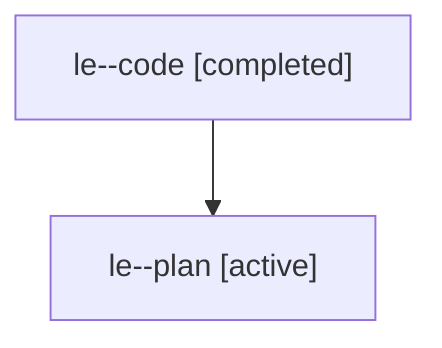

# Family: le

[Agent Hoods](../README.md) / [bbugyi200](../users/bbugyi200/README.md) / [athena](../users/bbugyi200/machines/athena/README.md) / [le](../users/bbugyi200/machines/athena/hoods/le/README.md) / le

Owner: `bbugyi200.athena` · Hood: `le` · Members: 2

## Lineage

The diagram is an optional enhancement; the ordered table below contains the same lineage in accessible text.

| Role | Agent | State | Model / provider | Timing | Commits | Prompt | Chat |
|---|---|---|---|---|---:|---|---|
| code | le--code | completed | gpt-5.6-sol / codex | 2026-07-26T11:55:43.735818+00:00 | [1](../agents/bbugyi200.athena.le--code/README.md#commits) | — | [Chat](../agents/bbugyi200.athena.le--code/chat.md) |
| plan | le--plan | active | gpt-5.6-sol / codex | 2026-07-26T11:51:03.114713+00:00 | 0 | [Prompt](../agents/bbugyi200.athena.le--plan/prompt.md) | [Chat](../agents/bbugyi200.athena.le--plan/chat.md) |

## Commits

| Role | Repo | Commit | Subject | Committed |
|---|---|---|---|---|
| code | sase | [`5c7f258`](https://github.com/sase-org/sase/commit/5c7f25834f1d4ae04bed2289cee9202f794dd7c1) | fix(xprompts): deprioritize epic agents | 2026-07-26 12:39:39 UTC |
