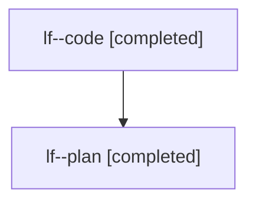

# Family: lf

[Agent Hoods](../README.md) / [bbugyi200](../users/bbugyi200/README.md) / [athena](../users/bbugyi200/machines/athena/README.md) / [lf](../users/bbugyi200/machines/athena/hoods/lf/README.md) / lf

Owner: `bbugyi200.athena` · Hood: `lf` · Members: 2

## Lineage

The diagram is an optional enhancement; the ordered table below contains the same lineage in accessible text.

| Role | Agent | State | Model / provider | Timing | Commits | Prompt | Chat |
|---|---|---|---|---|---:|---|---|
| code | lf--code | completed | gpt-5.6-sol / codex | 2026-07-26T12:14:54.773157+00:00 | [1](../agents/bbugyi200.athena.lf--code/README.md#commits) | — | [Chat](../agents/bbugyi200.athena.lf--code/chat.md) |
| plan | lf--plan | completed | opus / claude | 2026-07-26T12:07:10.206410+00:00 | 0 | [Prompt](../agents/bbugyi200.athena.lf--plan/prompt.md) | [Chat](../agents/bbugyi200.athena.lf--plan/chat.md) |

## Commits

| Role | Commit | Subject | Committed (UTC) |
|---|---|---|---|
| code | [`4b6c2c3`](https://github.com/sase-org/sase/commit/4b6c2c3cadf2ea71e9ff1d9f99df0f8ca5cb0a53) | docs: standardize epic phase description prefixes | 2026-07-26 12:52:57 |
