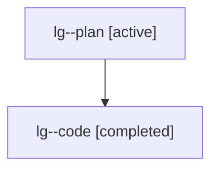

# Family: lg

[Agent Hoods](../README.md) / [bbugyi200](../users/bbugyi200/README.md) / [athena](../users/bbugyi200/machines/athena/README.md) / [lg](../users/bbugyi200/machines/athena/hoods/lg/README.md) / lg

Owner: `bbugyi200.athena` · Hood: `lg` · Members: 2

## Lineage

The diagram is an optional enhancement; the ordered table below contains the same lineage in accessible text.

| Role | Agent | State | Model / provider | Timing | Commits | Prompt | Chat |
|---|---|---|---|---|---:|---|---|
| plan | lg--plan | active | gpt-5.6-sol / codex | 2026-07-26T12:23:25.868463+00:00 | 0 | [Prompt](../agents/bbugyi200.athena.lg--plan/prompt.md) | [Chat](../agents/bbugyi200.athena.lg--plan/chat.md) |
| code | lg--code | completed | gpt-5.6-sol / codex | 2026-07-26T12:34:49.277287+00:00 | [1](../agents/bbugyi200.athena.lg--code/README.md#commits) | — | [Chat](../agents/bbugyi200.athena.lg--code/chat.md) |

## Commits

| Role | Repo | Commit | Subject | Committed |
|---|---|---|---|---|
| code | sase | [`0bff029`](https://github.com/sase-org/sase/commit/0bff029f30a56c04b8cf0488e68051355e25c49b) | feat(tui): color tribe identities consistently | 2026-07-26 13:08:02 UTC |
