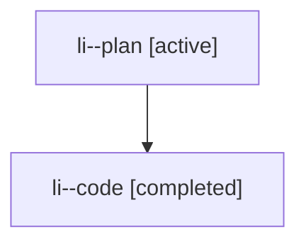

# Family: li

[Agent Hoods](../README.md) / [bbugyi200](../users/bbugyi200/README.md) / [athena](../users/bbugyi200/machines/athena/README.md) / [li](../users/bbugyi200/machines/athena/hoods/li/README.md) / li

Owner: `bbugyi200.athena` · Hood: `li` · Members: 2

## Lineage

The diagram is an optional enhancement; the ordered table below contains the same lineage in accessible text.

| Role | Agent | State | Model / provider | Timing | Commits | Prompt | Chat |
|---|---|---|---|---|---:|---|---|
| plan | li--plan | active | opus / claude | 2026-07-26T12:48:48.581430+00:00 | 0 | [Prompt](../agents/bbugyi200.athena.li--plan/prompt.md) | [Chat](../agents/bbugyi200.athena.li--plan/chat.md) |
| code | li--code | completed | gpt-5.6-sol / codex | 2026-07-26T13:04:57.783508+00:00 | [1](../agents/bbugyi200.athena.li--code/README.md#commits) | — | [Chat](../agents/bbugyi200.athena.li--code/chat.md) |

## Commits

| Role | Repo | Commit | Subject | Committed |
|---|---|---|---|---|
| code | sase | [`28c4097`](https://github.com/sase-org/sase/commit/28c40972a2c41abec5a165560da188ba732caac8) | feat(ace): show statuses for waited-on beads | 2026-07-26 09:27:31 EDT |
