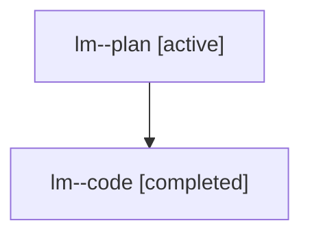

# Family: lm

[Agent Hoods](../README.md) / [bbugyi200](../users/bbugyi200/README.md) / [athena](../users/bbugyi200/machines/athena/README.md) / [lm](../users/bbugyi200/machines/athena/hoods/lm/README.md) / lm

Owner: `bbugyi200.athena` · Hood: `lm` · Members: 2

## Lineage

The diagram is an optional enhancement; the ordered table below contains the same lineage in accessible text.

| Role | Agent | State | Model / provider | Timing | Commits | Prompt | Chat |
|---|---|---|---|---|---:|---|---|
| plan | lm--plan | active | gpt-5.6-sol / codex | 2026-07-26T14:04:27.219528+00:00 | 0 | [Prompt](../agents/bbugyi200.athena.lm--plan/prompt.md) | [Chat](../agents/bbugyi200.athena.lm--plan/chat.md) |
| code | lm--code | completed | gpt-5.6-sol / codex | 2026-07-26T14:24:31.948704+00:00 | [1](../agents/bbugyi200.athena.lm--code/README.md#commits) | — | [Chat](../agents/bbugyi200.athena.lm--code/chat.md) |

## Commits

| Role | Repo | Commit | Subject | Committed |
|---|---|---|---|---|
| code | sase | [`7ba445a`](https://github.com/sase-org/sase/commit/7ba445a4514e0562bd2535c7d8482c1fc7b34cf6) | fix(beads): publish runner claim transitions synchronously | 2026-07-26 14:52:27 UTC |

## Neighbors

| Agent | Relation | State |
|---|---|---|
| [lm.w0](../agents/bbugyi200.athena.lm.w0/README.md) | descendant | waiting |
| [lm.w1](../agents/bbugyi200.athena.lm.w1/README.md) | descendant | active |
