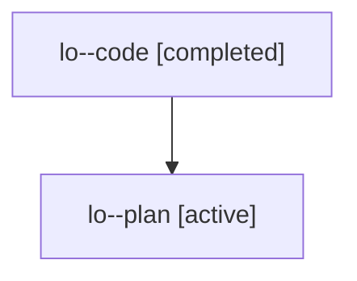

# Family: lo

[Agent Hoods](../README.md) / [bbugyi200](../users/bbugyi200/README.md) / [athena](../users/bbugyi200/machines/athena/README.md) / [lo](../users/bbugyi200/machines/athena/hoods/lo/README.md) / lo

Owner: `bbugyi200.athena` · Hood: `lo` · Members: 2

## Lineage

The diagram is an optional enhancement; the ordered table below contains the same lineage in accessible text.

| Role | Agent | State | Model / provider | Timing | Commits | Prompt | Chat |
|---|---|---|---|---|---:|---|---|
| code | lo--code | completed | gpt-5.6-sol / codex | 2026-07-26T15:01:54.991095+00:00 | [1](../agents/bbugyi200.athena.lo--code/README.md#commits) | — | [Chat](../agents/bbugyi200.athena.lo--code/chat.md) |
| plan | lo--plan | active | gpt-5.6-sol / codex | 2026-07-26T14:47:18.015562+00:00 | 0 | [Prompt](../agents/bbugyi200.athena.lo--plan/prompt.md) | [Chat](../agents/bbugyi200.athena.lo--plan/chat.md) |

## Commits

| Role | Repo | Commit | Subject | Committed (UTC) |
|---|---|---|---|---|
| code | sase | [`8fc6a2a`](https://github.com/sase-org/sase/commit/8fc6a2a901730ba20bf9b1339ae07d9a43f584e4) | fix(axe): remove persistent tab guide hint | 2026-07-26 15:25:45 |
