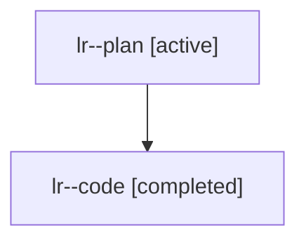

# Family: lr

[Agent Hoods](../README.md) / [bbugyi200](../users/bbugyi200/README.md) / [athena](../users/bbugyi200/machines/athena/README.md) / [lr](../users/bbugyi200/machines/athena/hoods/lr/README.md) / lr

Owner: `bbugyi200.athena` · Hood: `lr` · Members: 2

## Lineage

The diagram is an optional enhancement; the ordered table below contains the same lineage in accessible text.

| Role | Agent | State | Model / provider | Timing | Commits | Prompt | Chat |
|---|---|---|---|---|---:|---|---|
| plan | lr--plan | active | claude-fable-5 / claude | 2026-07-26T16:06:32.587125+00:00 | 0 | [Prompt](../agents/bbugyi200.athena.lr--plan/prompt.md) | [Chat](../agents/bbugyi200.athena.lr--plan/chat.md) |
| code | lr--code | completed | gpt-5.6-sol / codex | 2026-07-26T16:16:16.906739+00:00 | [1](../agents/bbugyi200.athena.lr--code/README.md#commits) | — | [Chat](../agents/bbugyi200.athena.lr--code/chat.md) |

## Commits

| Role | Repo | Commit | Subject | Committed |
|---|---|---|---|---|
| code | sase | [`08f163b`](https://github.com/sase-org/sase/commit/08f163b59e47983fff74a67ec59d519946d60bc5) | feat(ace): add prompt word definitions and spellcheck | 2026-07-26 17:05:09 UTC |
