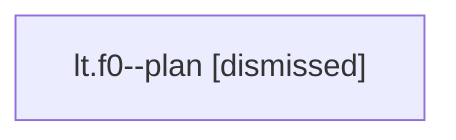

# Family: lt.f0

[Agent Hoods](../README.md) / [bbugyi200](../users/bbugyi200/README.md) / [athena](../users/bbugyi200/machines/athena/README.md) / [lt](../users/bbugyi200/machines/athena/hoods/lt/README.md) / lt.f0

Owner: `bbugyi200.athena` · Hood: `lt` · Members: 1

## Lineage

The diagram is an optional enhancement; the ordered table below contains the same lineage in accessible text.

| Role | Agent | State | Model / provider | Timing | Commits | Prompt | Chat |
|---|---|---|---|---|---:|---|---|
| plan | lt.f0--plan | dismissed | opus / claude | 2026-07-27T06:28:26.805887 → 2026-07-27T06:37:06.664384 | 0 | — | [Chat](../agents/bbugyi200.athena.lt.f0--plan/chat.md) |

## Neighbors

| Agent | Relation | State |
|---|---|---|
| [lt.f1](../agents/bbugyi200.athena.lt.f1/README.md) | lt hood | active |
