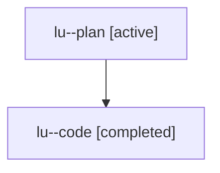

# Family: lu

[Agent Hoods](../README.md) / [bbugyi200](../users/bbugyi200/README.md) / [athena](../users/bbugyi200/machines/athena/README.md) / [lu](../users/bbugyi200/machines/athena/hoods/lu/README.md) / lu

Owner: `bbugyi200.athena` · Hood: `lu` · Members: 2

## Lineage

The diagram is an optional enhancement; the ordered table below contains the same lineage in accessible text.

| Role | Agent | State | Model / provider | Timing | Commits | Prompt | Chat |
|---|---|---|---|---|---:|---|---|
| plan | lu--plan | active | gpt-5.6-sol / codex | 2026-07-27T10:29:57.238173+00:00 | 0 | [Prompt](../agents/bbugyi200.athena.lu--plan/prompt.md) | [Chat](../agents/bbugyi200.athena.lu--plan/chat.md) |
| code | lu--code | completed | gpt-5.6-sol / codex | 2026-07-27T10:39:31.720430+00:00 | [1](../agents/bbugyi200.athena.lu--code/README.md#commits) | — | [Chat](../agents/bbugyi200.athena.lu--code/chat.md) |

## Commits

| Role | Repo | Commit | Subject | Committed |
|---|---|---|---|---|
| code | sase | [`05b45da`](https://github.com/sase-org/sase/commit/05b45da0193c11c084c80673208a38db045fc6a5) | fix(xprompt): preserve fork query spacing | 2026-07-27 11:32:00 UTC |
