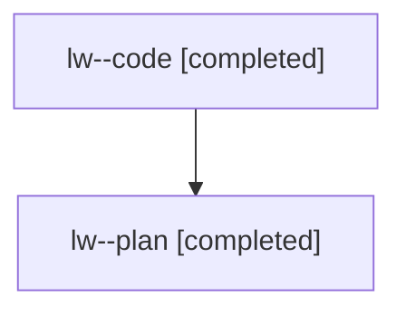

# Family: lw

[Agent Hoods](../README.md) / [bbugyi200](../users/bbugyi200/README.md) / [athena](../users/bbugyi200/machines/athena/README.md) / [lw](../users/bbugyi200/machines/athena/hoods/lw/README.md) / lw

Owner: `bbugyi200.athena` · Hood: `lw` · Members: 2

## Lineage

The diagram is an optional enhancement; the ordered table below contains the same lineage in accessible text.

| Role | Agent | State | Model / provider | Timing | Commits | Prompt | Chat |
|---|---|---|---|---|---:|---|---|
| code | lw--code | completed | gpt-5.6-sol / codex | 2026-07-27T10:50:38.284410+00:00 | [1](../agents/bbugyi200.athena.lw--code/README.md#commits) | — | [Chat](../agents/bbugyi200.athena.lw--code/chat.md) |
| plan | lw--plan | completed | opus / claude | 2026-07-27T10:38:52.354519+00:00 | 0 | [Prompt](../agents/bbugyi200.athena.lw--plan/prompt.md) | [Chat](../agents/bbugyi200.athena.lw--plan/chat.md) |

## Commits

| Role | Commit | Subject | Committed (UTC) |
|---|---|---|---|
| code | [`c9f2450`](https://github.com/sase-org/sase/commit/c9f2450ae0d1c0a183fa31f680670b281d2ae04b) | fix: defer epic completion notifications until launch settles | 2026-07-27 11:36:22 |
